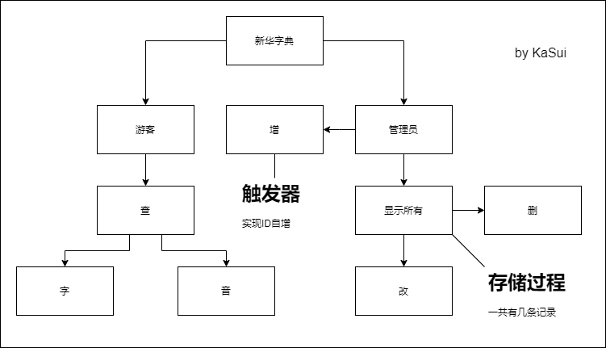

# oracle数据库应用开发实验报告

## 基本信息

### 选题

在线“新华字典”

### 成员

徐鑫涛  |  应超杰  |  李嘉豪

### 环境

Win10  |  VS2019  |  C#  |  Oracle 11g  |  PLSQL Developer

## 项目设计

### 系统设计



### 数据库设计

| xhdict表  字段设计 |            |        |            |          |
| :----------------: | :--------: | :----: | :--------: | :------: |
|       字段名       |  数据类型  | 主外键 | 是否可为空 |   说明   |
|         id         | number(10) |  主键  |     否     | 字的序号 |
|        word        |  char(4)   |   -    |     否     |  字本身  |
|        pron        |  char(10)  |   -    |     是     | 字的发音 |
|        mean        | char(200)  |   -    |     是     | 字的意思 |

| admint表  字段设计 |          |        |            |            |
| :----------------: | :------: | :----: | :--------: | :--------: |
|       字段名       | 数据类型 | 主外键 | 是否可为空 |    说明    |
|         id         | char(12) |  主键  |     否     | 管理员账号 |
|      password      | char(20) |   -    |     是     | 管理员密码 |

## 实验过程

### 创建用户

```sql
create user kasui identified by CxyXxt626525;
```

### 赋予权限

```sql
grant dba to kasui;
```

### 创建表

```sql
create table xhdict(id number(10) primary key,word char(4) not null,pron char(10),mean char(200));

create table admint(id char(12) primary key,password char(20));
```

### 插入数据

```sql
//登录
insert into admint(id,password) values('KaSui','CxyXxt626525');

//字典
insert into xhdict(id,word,pron,mean) values(1,'哀','ai','悲痛');

insert into xhdict(id,word,pron,mean) values(2,'爱','ai','对人和事有深挚的感情');

insert into xhdict(id,word,pron,mean) values(3,'拔','ba','抽，拉出，连根拽出');

insert into xhdict(id,word,pron,mean) values(4,'坝','ba','截住河流的构筑物');

insert into xhdict(id,word,pron,mean) values(5,'猜','cai','推测，推想');

insert into xhdict(id,word,pron,mean) values(6,'菜','cai','供作副食品的植物');

insert into xhdict(id,word,pron,mean) values(7,'答','da','回话，回复');

insert into xhdict(id,word,pron,mean) values(8,'打','da','击，敲，攻击');

insert into xhdict(id,word,pron,mean) values(9,'耳','er','听觉和平衡感觉的器官');

insert into xhdict(id,word,pron,mean) values(10,'二','er','数名');

insert into xhdict(id,word,pron,mean) values(11,'发','fa','交付，送出');

insert into xhdict(id,word,pron,mean) values(12,'伐','fa','砍');

insert into xhdict(id,word,pron,mean) values(13,'该','gai','应当');

insert into xhdict(id,word,pron,mean) values(14,'盖','gai','有遮蔽作用的东西');

insert into xhdict(id,word,pron,mean) values(15,'孩','hai','儿童，子女');

insert into xhdict(id,word,pron,mean) values(16,'海','hai','靠近大陆，比洋小的水域');

insert into xhdict(id,word,pron,mean) values(17,'极','ji','顶端，最高点，尽头');

insert into xhdict(id,word,pron,mean) values(18,'计','ji','核算');

insert into xhdict(id,word,pron,mean) values(19,'开','kai','启，张，把关闭的东西打开');

insert into xhdict(id,word,pron,mean) values(20,'铠','kai','古代的战衣，可以保护身体');

insert into xhdict(id,word,pron,mean) values(21,'拉','la','牵，扯，拽');

insert into xhdict(id,word,pron,mean) values(22,'腊','la','干肉');

insert into xhdict(id,word,pron,mean) values(23,'埋','mai','葬');

insert into xhdict(id,word,pron,mean) values(24,'买','mai','拿钱换东西');

insert into xhdict(id,word,pron,mean) values(25,'拿','na','用手取，握在手里');

insert into xhdict(id,word,pron,mean) values(26,'纳','na','收入，放进');

insert into xhdict(id,word,pron,mean) values(27,'讴','ou','歌唱')u;

insert into xhdict(id,word,pron,mean) values(28,'偶','ou','用木头或泥土制成的人形');

insert into xhdict(id,word,pron,mean) values(29,'趴','pa','肚子向下卧倒');

insert into xhdict(id,word,pron,mean) values(30,'怕','pa','恐惧');

insert into xhdict(id,word,pron,mean) values(31,'凄','qi','寒冷');

insert into xhdict(id,word,pron,mean) values(32,'奇','qi','特殊的，稀罕，不常见的');

insert into xhdict(id,word,pron,mean) values(33,'如','ru','依照顺从');

insert into xhdict(id,word,pron,mean) values(34,'入','ru','进，由外到内');

insert into xhdict(id,word,pron,mean) values(35,'撒','sa','放开，发出');

insert into xhdict(id,word,pron,mean) values(36,'飒','sa','凉爽的样子');

insert into xhdict(id,word,pron,mean) values(37,'塌','ta','倒，下陷');

insert into xhdict(id,word,pron,mean) values(38,'沓','ta','多，重复');

insert into xhdict(id,word,pron,mean) values(39,'挖','wa','掘，掏');

insert into xhdict(id,word,pron,mean) values(40,'娃','wa','小孩子');

insert into xhdict(id,word,pron,mean) values(41,'夕','xi','日落的时候');

insert into xhdict(id,word,pron,mean) values(42,'戏','xi','玩耍');

insert into xhdict(id,word,pron,mean) values(43,'牙','ya','齿');

insert into xhdict(id,word,pron,mean) values(44,'亚','ya','较差');

insert into xhdict(id,word,pron,mean) values(45,'凿','zao','穿孔，挖掘');

insert into xhdict(id,word,pron,mean) values(46,'皂','zao','黑色');
```

### 创建id自增序列

```sql
create sequence xhdict_id_seq
minvalue 1
maxvalue 9999999999
start with 1
increment by 1;
```

### 创建id自增触发器

```sql
create or replace trigger xhdict_ins_trg
  before insert
  on xhdict 
  for each row when(new.id is null)
declare
  -- local variables here
begin
  select xhdict_id_seq.nextval into :new.id from DUAL;
end xhdict_ins_trg;
```

### 创建查看记录数储存过程

```sql
create or replace procedure countnum(num out sys_refcursor) is
begin
  open num for select count(*) from xhdict;
end countnum;
```

### 连接数据库类

```c#
using System.Data.OracleClient;

class conn
{
    //用于连接数据库的配置
    private string myconn = "Data Source=localhost/Dict;User ID=kasui;PassWord=CxyXxt626525";
    //查
    public DataTable ExecuteQuery(string sqlStr)
    {
        OracleConnection conn = new OracleConnection(myconn);
        conn.Open();
        OracleCommand cmd = new OracleCommand(sqlStr,conn);
        DataTable dt = new DataTable();
        OracleDataAdapter oda = new OracleDataAdapter();
        oda.SelectCommand = cmd;
        oda.Fill(dt);
        conn.Close();
        return dt;
    }
    //增删改
    public int ExecuteUpdate(string sqlStr)
    {
        OracleConnection conn = new OracleConnection(myconn);
        conn.Open();
        OracleCommand cmd = new OracleCommand(sqlStr,conn);
        int rst = 0;
        rst = cmd.ExecuteNonQuery();
        conn.Close();
        return rst;
    }
    //管理员登录
    public int ExecuteLogin(string sqlStr)
    {
        OracleConnection conn = new OracleConnection(myconn);
        conn.Open();
        OracleCommand cmd = new OracleCommand(sqlStr, conn);
        DataSet ds = new DataSet();
        OracleDataAdapter oda = new OracleDataAdapter();
        oda.SelectCommand = cmd;
        int rst = 0;
        rst=oda.Fill(ds);
        conn.Close();
        return rst;
    }
    //调用存储过程返回记录数
    public string ExecutePrc(string prc,string cs)
    {
        OracleConnection conn = new OracleConnection(myconn);
        OracleCommand cmd = new OracleCommand(prc, conn);
        cmd.CommandType = CommandType.StoredProcedure;
        OracleParameter op = new OracleParameter(cs, OracleType.Cursor);
        op.Direction = ParameterDirection.Output;
        cmd.Parameters.Add(op);
        OracleDataAdapter oda = new OracleDataAdapter(cmd);
        DataTable dt = new DataTable();
        oda.Fill(dt);
        string rst = "";
        rst = dt.Rows[0][0].ToString();
        conn.Close();
        return rst;
    }
}
```

### 查询界面设计


### 查询主要代码

```c#
conn c = new conn();
String sqlStr = "select * from xhdict where word='" + textBox1.Text.ToString() + "'";
//清空datagridview中数据
dataGridView1.DataSource = null;
dataGridView1.Rows.Clear();
DataTable d1 = new DataTable();
d1 = c.ExecuteQuery(sqlStr);
dataGridView1.DataSource = d1;
dataGridView1.Columns[0].HeaderText = "ID";
dataGridView1.Columns[1].HeaderText = "WORD";
dataGridView1.Columns[2].HeaderText = "PRON";
dataGridView1.Columns[3].HeaderText = "MEAN";
```

### 管理员登录界面设计


### 管理员登录主要代码

```c#
conn c = new conn();
String sqlStr = "select id, password from admint where id = '" + textBox1.Text.ToString() + "' and password = '" + textBox2.Text.ToString() + "'";
int rst = c.ExecuteLogin(sqlStr);
if (rst != 0)
{
	MessageBox.Show("登录成功！", "登录结果", MessageBoxButtons.OK, MessageBoxIcon.Information);
	Form admin = new Form3();
	this.Hide();
	admin.ShowDialog();
}
else
{
	MessageBox.Show("登录失败！请检查用户名和密码！", "登录结果", MessageBoxButtons.OK,MessageBoxIcon.Information);
}
```

### 添加记录界面设计


### 添加记录主要代码

```c#
conn c = new conn();
string sql = "insert into xhdict(word,pron,mean) values('" + textBox1.Text + "','" + textBox2.Text + "','" + textBox3.Text + "')";
try
{
    int rst = c.ExecuteUpdate(sql);
    if (rst != 0)
    {
    	MessageBox.Show("添加成功！", "添加结果", MessageBoxButtons.OK, MessageBoxIcon.Information);
	}
}
catch
{
	MessageBox.Show("添加失败！请重新添加！", "添加结果", MessageBoxButtons.OK, MessageBoxIcon.Information);
}
```

### 删除记录界面设计


### 删除记录主要代码

```c#
conn c = new conn();
string sql = "delete from xhdict where word='" + textBox1.Text + "'";
int rst = c.ExecuteUpdate(sql);
if (rst != 0)
{
	MessageBox.Show("删除成功！", "删除结果", MessageBoxButtons.OK, MessageBoxIcon.Information);
}
else
{
	MessageBox.Show("删除失败！请重新删除！", "删除结果", MessageBoxButtons.OK, MessageBoxIcon.Information);
}
```

### 修改记录界面设计


### 修改记录主要代码

```c#
conn c = new conn();
string sql= "";
if (textBox2.Text == "" && textBox3.Text != "")
{
	sql = "update xhdict set mean='" + textBox3.Text + "' where word='" + textBox1.Text + "'";
}
else if (textBox3.Text == "" && textBox2.Text != "")
{
	sql = "update xhdict set pron='" + textBox2.Text + "' where word='" + textBox1.Text + "'";
}
else if (textBox3.Text == "" && textBox2.Text == "")
{
	MessageBox.Show("音和意不能同时为空！", "错误输入", MessageBoxButtons.OK, MessageBoxIcon.Information);
}
else if (textBox3.Text != "" && textBox2.Text != "")
{
	sql = "update xhdict set pron='" + textBox2.Text + "',mean='" + textBox3.Text + "' where word='" + textBox1.Text + "'";
}
try{
    int rst = c.ExecuteUpdate(sql);
    if (rst != 0)
    {
    	MessageBox.Show("修改成功！", "修改结果", MessageBoxButtons.OK, MessageBoxIcon.Information);
    }
}
catch
{
	MessageBox.Show("修改失败！请重新修改！", "修改结果", MessageBoxButtons.OK, MessageBoxIcon.Information);
}
```

## 功能模块

### 用户查询


### 管理员登录


### 管理员查看所有


### 管理员添加记录


### 管理员修改记录


### 管理员删除记录


## 总结

Oracle连接数据库使用 System.Data.OracleClient ，但方法已过时。

对Oracle数据库的序列，触发器，存储过程的创建和调用有了一定了解。

直接执行错误语言时会报错，用 try/catch 解决。

C# if 条件要写全。

下次试试给 FromX.cs 取个名儿吧，窗口多了有点混乱。
